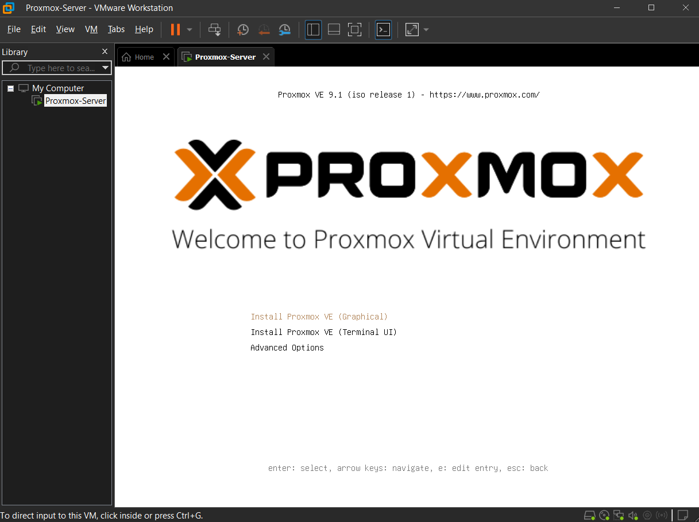
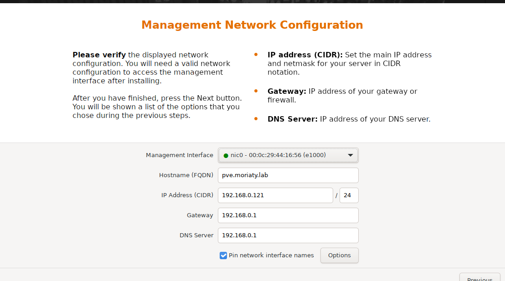
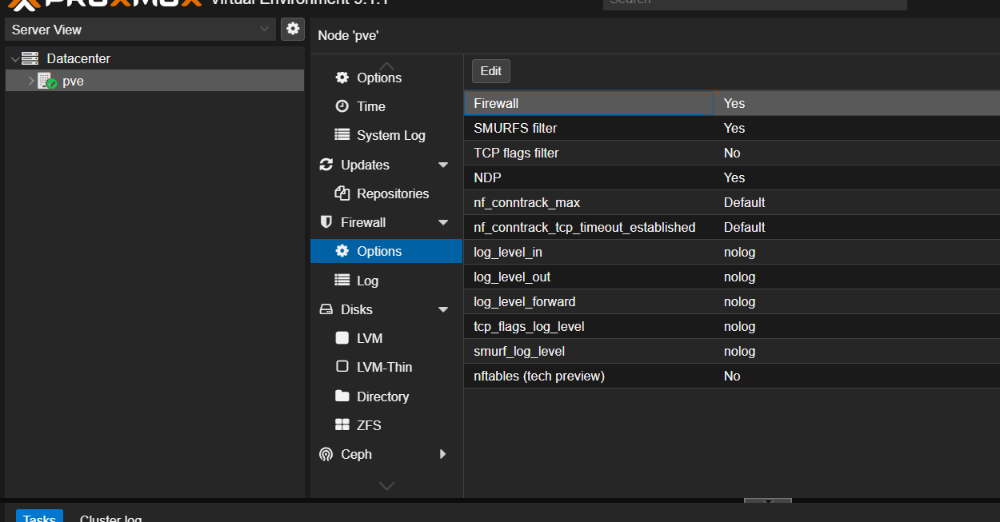
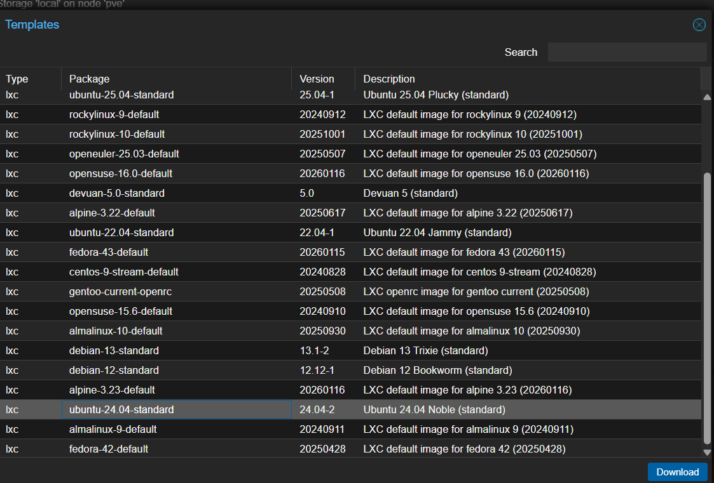
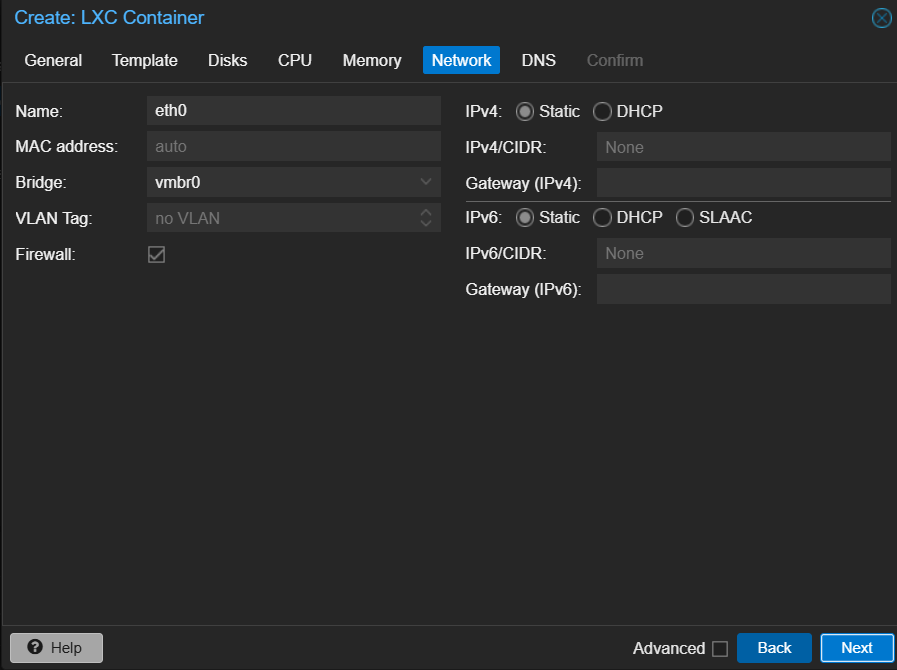
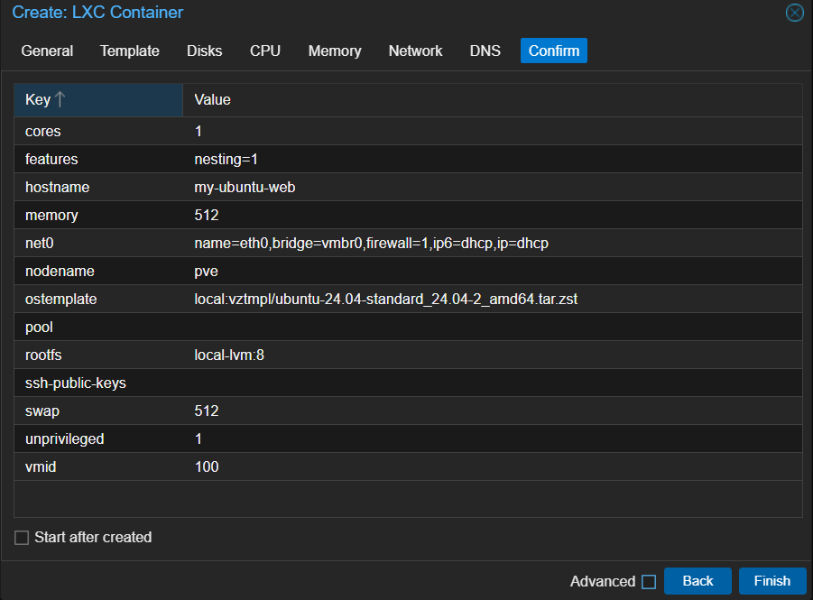
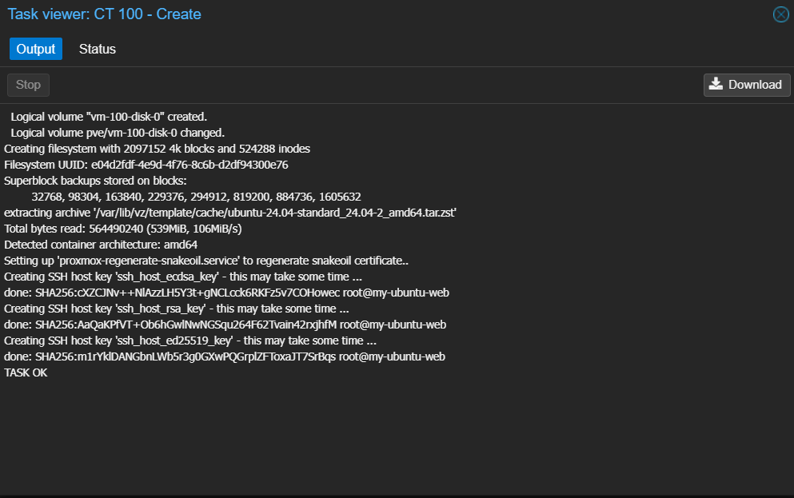
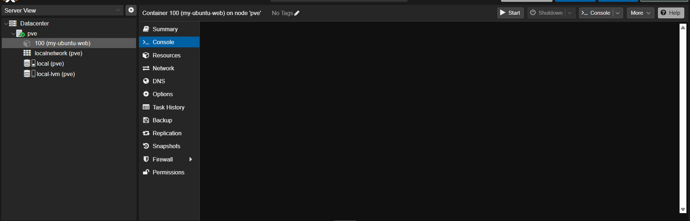
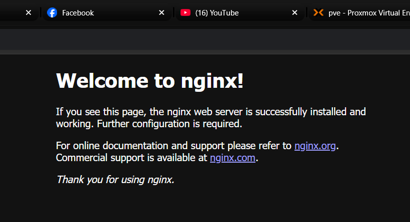

# 🚀 SkyNet-v1-Local: My Private Cloud Journey
### Phase I: The Core – From "Nested Virtualization" to a Live Web Server

## 📖 The Story
It’s 3 AM, and while most people are sleeping, I’m deep in the world of Hypervisors. My goal? To take a standard laptop and turn it into a production-ready, single-node private cloud using **Proxmox VE 9.1**. 

Because I wanted a safe "sandbox" to break things without ruining my main OS, I took the "Inception" route: running Proxmox inside VMware Workstation.

---

## 🌩️ The "Battle with the BIOS" (The Struggle is Real)
Before the "Aha!" moments, there were the "Why me?" moments. Setting up **Nested Virtualization** isn't as simple as checking a box. 

I actually had to **restart my laptop about 4 times** just to get Proxmox to cooperate. Here is what I ran into:

* **The "Virtualization Disabled" Trap:** Even though I enabled it in the BIOS, VMware kept complaining.
* **The Core Isolation Headache:** I had to dive into Windows Security settings to disable "Memory Integrity" because it was hogging the virtualization engine.
* **The Loop:** Restart -> Change BIOS -> Windows Update interrupts -> Restart -> VMware Error -> Restart.
* **The Victory:** On the 4th try, the Proxmox installer finally saw the "Virtualization Support" and let me through. 

> **Pro-Tip:** If you're reading this and struggling: Don't give up. The 4th restart is usually the charm.

---

## 🏗️ The Architecture
This isn't just a simple install; it’s a layered stack of technology:
* **Physical Layer:** My Laptop (The unsung hero).
* **Virtualization Layer 1:** VMware Workstation (The Sandbox).
* **Virtualization Layer 2 (The Brain):** Proxmox VE 9.1.
* **Workload Layer:** Ultra-lightweight Ubuntu 24.04 LXC Containers.

---

## 🛠️ Phase I: Hardening & Optimization
A "fresh install" isn't a "production install." I spent this phase hardening the system and stripping away the bloat.

### 1. The "No-Subscription" Hack
Proxmox usually asks for a paid enterprise license. I manually reconfigured the Debian repositories via the Shell to point to the **No-Subscription community repos**. 
* **Skill Unlocked:** Linux Repository Management (`sources.list`).

### 2. The eXtremeSHOK Treatment
I ran a high-level optimization script to:
* Fine-tune the Kernel for better performance.
* Set up `pigz` for 2x faster compression.
* Protect the web interface with `fail2ban`.

### 3. Networking & Bridging (The IP Discovery)
I configured `vmbr0` (Virtual Bridge) to allow my containers to talk to my home router. By using **DHCP**, my containers get real IPs on my network, making them accessible from any device in the house.

---

## 📦 The "Aha!" Moment: My First Container
Instead of a heavy Virtual Machine (VM), I opted for an **LXC Container**. 
* **OS:** Ubuntu 24.04 LTS.
* **Resources:** Only 512MB RAM and 1 CPU Core.
* **The Result:** It boots in under 5 seconds!

### The Live Test 🌐
To prove the cloud was functional, I installed **Nginx** inside the container. 
1.  **Command:** `apt install nginx -y`
2.  **IP Discovery:** `hostname -I` -> `192.168.0.227`
3.  **The Victory:** Opening that IP in my Windows Chrome browser and seeing the *"Welcome to Nginx!"* page.

---

## 🧠 Key Takeaways
* **Patience is a technical skill:** Fighting with VMware and BIOS settings for an hour taught me more than a smooth install ever would.
* **LXC > VM:** For my micro-services, containers are much more efficient.
* **RAID matters:** I learned that while I skipped RAID for this lab, in a real data center, I’d need it to prevent data loss.

---

## ⏩ What’s Next? (Phase II: Automation)
Now that I’ve built this manually, **I’m never doing it again manually.** **Next Goal:** Use **Infrastructure as Code (IaC)**. I will use **OpenTofu/Terraform** and **Ansible** to write code that builds this entire setup automatically in minutes.

## 📸 Technical Journey Gallery

<b>🛠️ Phase 1: The Installation & Hardening</b>

| Step | Description | Screenshot |
| :--- | :--- | :--- |
| **01** | Proxmox ISO Bootloader |  |
| **02** | Network & FQDN Setup (`pve.moriaty.lab`) |  |
| **03** | **The Debug:** 401 Unauthorized Error |  |
| **04** | **The Fix:** Manual Repo Configuration |  |
| **05** | Storage LVM Recognition |  |

<b>📦 Phase 2: Creating the First Container (LXC)</b>

| Step | Action | Screenshot |
| :--- | :--- | :--- |
| **06** | Downloading Ubuntu 24.04 Template |  |
| **07** | Resource Allocation (CPU/RAM) |  |
| **08** | Container Network Bridging |  |
| **09** | **Success:** Task OK! |  |

<b>🌐 Phase 3: The Final Deployment</b>

### 🏆 The Victory Shot
Everything is live. The Ubuntu container is running Nginx, and the web server is accessible from the host browser.

*Proxmox Dashboard showing the active `my-ubuntu-web` node.*

*The final result: Nginx Welcome Page served from the nested cloud.*

---
> *"The cloud isn't just a place; it's a set of skills. Today, I built the foundation."* 🚀⚡
---

## 👨‍💻 About the Author
**Merzougui Abdellah El Ghazali** *Backend Developer | DevOps Enthusiast | Vice President @ ESTIN Cloud Hub (ECH)*

I’m a 2nd-year CS student passionate about low-level systems and infrastructure automation. This project is part of my journey to master the "S" in DevOps—**Systems**. 

* 🌍 **University:** ESTIN (Ecole Supérieure en Sciences et Technologies de l'Informatique et du Numérique)
* 🛠️ **Focus:** Linux Internals, Infrastructure as Code, and Automated Workflows.
* 📫 **Connect:** [GitHub Profile](https://github.com/moriadim) | [LinkedIn](YOUR_LINKEDIN_URL_HERE)

---
*© 2026 Abdellah Merzougui. Built with ☕ and 🐧.*